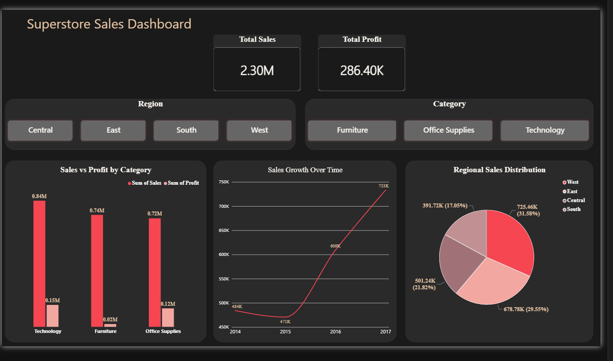

# 📊 Superstore Sales Analysis Dashboard

An end-to-end sales analysis of a retail Superstore dataset using **SQL**, **Excel**, and **Power BI** — from raw data cleaning to an interactive, presentation-ready dashboard.

---

## 🎯 Project Goal

Analyze retail sales data (9,994 orders) to answer real business questions:
- Which categories are the top performers in sales and profit?
- How do sales vary across regions?
- What is the sales growth trend over time?
- Is there a gap between "high sales" and "actual profitability"?

## 🛠️ Tools Used

| Tool | Purpose |
|---|---|
| **SQL (SQLite)** | Analytical queries: aggregation, sorting, Window Functions (`LAG`) for month-over-month growth |
| **Excel** | Pivot Tables, Conditional Formatting, initial charts |
| **Power BI** | Full interactive dashboard with slicers and KPI cards |

## 🔍 Methodology

1. **Data Preparation:** Converted the raw CSV into a SQLite database for querying
2. **SQL Analysis:** Wrote queries to extract top profitable products, sales/profit by category, and monthly growth using `LAG()`
3. **Excel:** Built a Pivot Table comparing sales by region and category, with conditional formatting to highlight top/bottom performers
4. **Power BI:** Built a fully interactive dashboard with a dark professional theme, including KPI cards, comparison charts, a time trend, and regional distribution

## 💡 Key Insights

- **Technology** is the top-performing category in both sales and profit (0.84M in sales), leading by a clear margin
- **Furniture** has high sales (0.74M) but **disproportionately low profit** — a likely sign of heavy discounting or thin margins that warrants a pricing review
- **West** is the top-performing region (31.58% of total sales), followed by East then Central
- Sales showed **strong, accelerating growth** between 2014 and 2017 (from ~484K to ~733K)

## 📁 Project Contents

- `superstore.db` — SQLite database
- `Superstore_Analysis.xlsx` — Excel analysis (raw data + SQL results + Pivot Table)
- `dashboard.png` — Final Power BI dashboard screenshot

---

*Data source: [Sample Superstore Dataset](https://www.kaggle.com/datasets/vivek468/superstore-dataset-final)*
